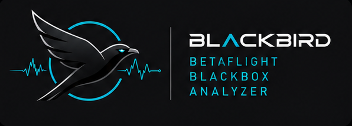

<p align="center">
  
</p>

<p align="center">
  <a href="LICENSE"></a>
  <a href="https://github.com/PedroS235/blackbird/releases/latest"></a>
</p>

Blackbird is a native desktop tool for analysing Betaflight blackbox logs.
Free, open source, single binary — no MATLAB, no runtime, no installer.

## Features

- **Timeseries** — gyro, RC command, motor, power/battery, RSSI
- **Filter Analysis** — spectral heatmap, PSD, spectrogram, vs-reference
- **PID Analysis** — step response (Wiener deconvolution) with per-axis
  metrics, gyro vs setpoint

## Status

Early development. The log viewer and analysis panels above work today.
AI-assisted tuning guidance is planned but not built yet.

## Install

Grab a binary from the [latest release](https://github.com/PedroS235/blackbird/releases/latest):

| OS | File |
|---|---|
| Linux | `blackbird-linux-x86_64` |
| macOS | `blackbird-macos-x86_64` |
| Windows | `blackbird-windows-x86_64.exe` |

Binaries aren't signed:

- **macOS**: Gatekeeper blocks it on first run — clear it with
  `xattr -d com.apple.quarantine ./blackbird-macos-x86_64`
- **Windows**: SmartScreen will warn — click **More info → Run anyway**

On Linux/macOS, mark it executable first: `chmod +x ./blackbird-*`

## Build from source

Requires stable Rust.

```sh
git clone https://github.com/PedroS235/blackbird.git
cd blackbird
cargo build --release
```

Linux also needs: `libgtk-3-dev libxcb-render0-dev libxcb-shape0-dev libxcb-xfixes0-dev libxkbcommon-dev libssl-dev`

Note: pulls a patched fork of `blackbox-log` via git, so the build needs
network access.

## Roadmap & contributing

In-progress work is tracked as issues under `.scratch/`. See `CLAUDE.md` for
architecture and design decisions.

## License

MIT — see [LICENSE](LICENSE).
